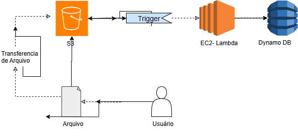

# 🛠️ Desafio DIO: Arquitetura de Processamento com AWSDocumentação do laboratório de EC2 na AWS pela DIO

Este repositório documenta minha proposta de arquitetura para o desafio da DIO sobre gerenciamento de instâncias EC2 na AWS. Optei por representar uma solução arquitetural que utiliza serviços gerenciados da AWS para processamento de arquivos de forma escalável e eficiente.

---

## 🎯 Objetivo

Demonstrar a compreensão dos conceitos de computação em nuvem e arquitetura de soluções utilizando serviços da AWS, com foco em EC2, S3, Lambda e DynamoDB. A proposta foi representar visualmente o fluxo de dados e os componentes envolvidos em um cenário prático de processamento de arquivos.

---

## 🧩 Arquitetura Proposta

A imagem abaixo representa o fluxo de dados entre os serviços da AWS:

📥 **Usuário envia um arquivo** →  
🗂️ **Arquivo é armazenado no S3** →  
⚡ **Trigger ativa uma função Lambda** →  
🧠 **Lambda processa o arquivo** →  
🗃️ **Resultado é armazenado no DynamoDB**

> Essa abordagem representa uma arquitetura serverless, onde o EC2 é substituído por Lambda para reduzir custos e aumentar a escalabilidade.

---

## 🧐 O que foi feito?

- Criação de um diagrama de arquitetura com os seguintes componentes:
  - Amazon S3
  - Trigger de evento
  - AWS Lambda (representando EC2 logicamente)
  - Amazon DynamoDB
- Geração de imagem ilustrativa para facilitar a compreensão visual

---

## 📚 Ferramentas Utilizadas

- AWS (S3, Lambda, DynamoDB)
- Markdown
- GitHub
- Ferramentas de design para o diagrama

---

## 💡 Insights

- O uso de S3 como ponto de entrada para arquivos permite escalabilidade e integração com outros serviços.
- Lambda é uma alternativa eficiente ao EC2 para tarefas pontuais e automatizadas.
- DynamoDB oferece armazenamento rápido e flexível para os resultados processados.
- Arquiteturas serverless reduzem complexidade operacional e custos de infraestrutura.

---

## 🔗 Recursos Úteis

- [Documentação AWS EC2](https://docs.aws.amazon.com/pt_br/AWSEC2/latest/UserGuide/concepts.html)
  
---

## 👤 Autor

**Andresa Marçal**  
Poá, São Paulo, Brasil  
[GitHub](https://github.com/amarcal07)
